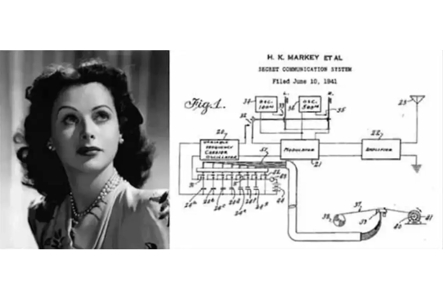

# DirectSequenceSpreadSpectrum

## 🚀 Overview


This project investigates spread spectrum transmission using a direct sequence spreading technique. Performance evaluation is first conducted over a Gaussian channel, with the possible presence of a jammer. Then, an experimental transmission over an acoustic channel is performed. The entire study is carried out in the Jupyter Notebook environment.

## 🎯 Purpose
- 🌌 **Spread Spectrum Transmission**: Analyze direct sequence spread spectrum (DSSS) techniques.
- 📊 **Performance Evaluation**: Assess system performance under Gaussian noise and jamming conditions.
- 🔊 **Acoustic Channel Experimentation**: Implement DSSS transmission over an acoustic medium.
- 🖥️ **Jupyter Notebook Implementation**: Develop and document the study in a Jupyter Notebook environment.

## 📝 Features
| 🏷️ Feature                 | 🔍 Description |
|----------------------------|-------------|
| 🌌 **Direct Sequence DSSS** | Implements direct sequence spread spectrum transmission |
| 📊 **Performance Metrics** | Evaluate system performance in different noise conditions |
| 🚀 **Jamming Resilience** | Study system robustness against intentional interference |
| 🔊 **Acoustic Transmission** | Test DSSS communication over an acoustic channel |
| 🖥️ **Jupyter Notebook** | Full implementation and documentation in Python |

## 🔬 Methodology
| 🌌 Signal Spreading | 📊 Performance Evaluation | 🔊 Acoustic Transmission |
|-----------|-----------|-----------|
|  |  |  |

## 📚 Architecture
```
/spread-spectrum-transmission
│── notebooks/
│ ├── 01_transmitter.ipynb # DSSS transmitter implementation
│ ├── 02_receiver.ipynb # DSSS receiver implementation
│ ├── 03_awgn_channel.ipynb # AWGN channel simulation
│ ├── 04_performance.ipynb # Performance evaluation (BER, SNR)
│ ├── 05_jamming.ipynb # Jamming impact analysis
│ ├── 06_dbpsk.ipynb # DBPSK implementation
│ ├── 07_audio_transmission.ipynb # Audio experimentation
│── src/
│ ├── dsp_utils.py # Signal processing utilities
│ ├── modulation.py # Implementation of BPSK and DBPSK modulations
│ ├── spreading.py # Spread sequence generation
│ ├── filtering.py # RRC filters and delay compensation
│── data/
│ ├── audio/ # Audio signals recorded for testing
│ ├── parameters/ # Transmission parameters saved
│ ├── images/ # Images used for transmission
│── results/
│ ├── figures/ # Graphics generated (spectrograms, BER, etc.)
│ ├── logs/ # Experiment results
│── README.md # Project documentation
│── requirements.txt # Libraries required (numpy, scipy, matplotlib...)
│── environment.yml # Jupyter configuration file
```

## 📚 Report & Code
The project deliverables include:
- A detailed report illustrating the results obtained for each step.
- The full implementation in a Jupyter Notebook.

## 🌟 License
This project is open-source. Feel free to use, modify, and contribute! 🚀
